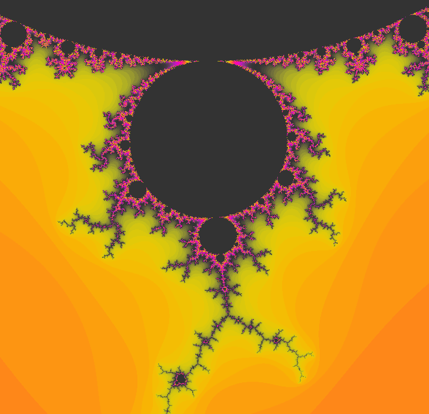

# Fractol

Fractol is a graphical project that visualizes various mathematical fractals, such as Mandelbrot, Julia, and Newton. The project was created as part of the 42 School curriculum and uses the MLX42 graphical library.



## Features

- Fractal visualization:
  - Mandelbrot
  - Julia
  - Newton (bonus mode)
- Dynamic zooming in and out using the mouse or keyboard
- User interaction support:
  - Panning the view
  - Real-time parameter adjustments for fractals
- Special visual effects:
  - TV Static effect with scan lines and glitches
  - Psychedelic dreamlike color patterns with vibrant hues
  - Color cycling with vivid yellows, oranges, purples and reds
- Interactive color schemes for enhanced visualization

## Project Structure

```
fractol/
├── fractol.h         # Main header file with struct definitions and prototypes
├── main.c            # Program entry point and initialization
├── mandelbrot.c      # Mandelbrot set implementation
├── julia.c           # Julia set implementation
├── bonus.c           # Newton fractal (bonus) implementation
├── effects.c         # Visual effects including TV static and psychedelic modes
├── ft_atod.c         # Utility for converting ASCII to double
├── key_hooks.c       # Keyboard input handling
├── mouse_hooks.c     # Mouse input handling
├── utils.c           # Utility functions for mapping and coloring
├── Makefile          # Build configuration
├── libft/            # Custom C library (submodule)
│   └── ...
└── MLX42/            # Graphics library
    └── ...
```

## Mathematical Background

### The Mandelbrot Set

The Mandelbrot set is defined as the set of complex numbers `c` for which the function `f(z) = z² + c` does not diverge when iterated from `z = 0`. In other words, a complex number `c` is part of the Mandelbrot set if, when starting with `z = 0` and applying the iteration repeatedly, the result stays bounded (does not escape to infinity).

### The Julia Set

The Julia set is related to the Mandelbrot set but with a key difference. For a fixed complex parameter `c`, the Julia set is the set of complex numbers `z` for which the function `f(z) = z² + c` remains bounded when iterated. Each different value of `c` gives a different Julia set.

### The Newton Fractal

Newton fractals are based on Newton's method for finding roots of complex functions. The fractal is generated by applying Newton's method to a polynomial function and coloring points based on which root the iteration converges to.

## Requirements

- Linux operating system
- Installed libraries:
  - MLX42
  - glfw
  - libft (custom library included as a submodule).

## Installation

### Prerequisites

Ensure you have the following installed:
- GCC compiler
- Make
- Git
- GLFW3 development libraries

### Step-by-step Installation

1. **Clone the repository and navigate to the project directory:**
   ```bash
   git clone https://github.com/trosinski08/fractol.git
   cd fractol
   ```

2. **Initialize and update submodules:**
   ```bash
   git submodule update --init --recursive
   ```

3. **Install required packages:**

   **On Linux/WSL:**
   ```bash
   sudo apt update
   sudo apt install libglfw3-dev build-essential cmake
   ```

   **On macOS (using Homebrew):**
   ```bash
   brew install glfw cmake
   ```

4. **Build the project:**
   ```bash
   make
   ```

5. **Verify the installation:**
   ```bash
   ./fractol mandelbrot
   ```

### Troubleshooting

If you encounter build errors:

1. Make sure all dependencies are properly installed
2. Check that submodules are properly initialized
3. For WSL users, ensure XServer is properly configured for graphical display

## Usage

Run the program with the appropriate arguments:  
./fractol [fractal] [optional parameters]  

### Examples:
- Mandelbrot:  
  ./fractol mandelbrot  

- Julia (with parameters):  
  ./fractol julia -0.8 0.156  

- Newton (bonus mode):  
  ./fractol newton  

### Controls

| Key/Mouse | Action |
|-----------|--------|
| Arrow Keys | Move the view (pan) |
| Mouse Scroll | Zoom in/out at cursor position |
| + / - (Numpad) | Increase/decrease maximum iterations |
| ESC | Exit the program |
| Mouse Movement | For Julia set: dynamically change parameters |
| R | Toggle TV Static visual effect with random noise |
| P | Toggle Psychedelic visual effect with vibrant colors |
| C | Toggle Color Cycling mode (works with Psychedelic effect) |
| N | Turn off all visual effects |

## Performance

The rendering algorithm has been optimized for performance:
- Efficient iteration calculation
- Dynamic iteration limit to balance detail and speed
- Optimized memory usage for image buffer

### Performance Benchmarks
| Resolution | Fractal | Average FPS |
|------------|---------|-------------|
| 720x720 | Mandelbrot | ~60 FPS |
| 720x720 | Julia | ~70 FPS |
| 720x720 | Newton | ~50 FPS |
| 720x720 | With TV Static effect | ~55 FPS |
| 720x720 | With Psychedelic effect | ~58 FPS |

## Gallery

Here are some interesting views that can be generated with this program:


## Visual Effects

### TV Static Effect
The TV Static effect simulates the look of old television static with random noise patterns, white pixels, and horizontal scan lines. It includes:
- Random noise generation with varied color intensities
- Horizontal scan lines that move through the image
- TV-like glitches and artifacts
- Black areas of the fractal are preserved

### Psychedelic Effect
The psychedelic effect creates a vivid, dreamlike color experience with:
- Vibrant, saturated colors focusing on yellows, oranges, reds, purples, and bright greens
- Dynamic pulsating patterns that shift and change over time
- Center-outward patterns that transition to chaotic/explosive motions
- Color cycling option for continuously shifting color palettes
- Occasional bursts of color intensity

## Future Enhancements

Planned future enhancements include:
- Multi-threading for faster rendering of high-resolution fractals
- Additional fractal types (Burning Ship, Tricorn, etc.)
- Save functionality to export fractal images
- More visual effect modes and color algorithms
- GPU acceleration for real-time exploration of deep zoom levels

## Contributing

Contributions are welcome! Please feel free to submit a Pull Request.

## License

This project is licensed under the MIT License - see the [LICENSE](LICENSE) file for details.

## Links

- [What is the Mandelbrot Set?](https://en.wikipedia.org/wiki/Mandelbrot_set)
- [Julia Set](https://en.wikipedia.org/wiki/Julia_set)
- [Newton Fractal](https://en.wikipedia.org/wiki/Newton_fractal)
- [MLX42 Library](https://github.com/codam-coding-college/MLX42)

## Author

This project was created by [Tomasz Rosiński](https://github.com/trosinski08) as part of the 42 School curriculum.